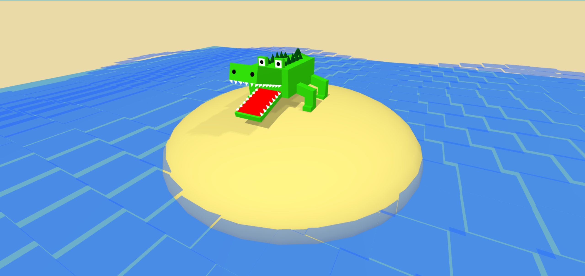
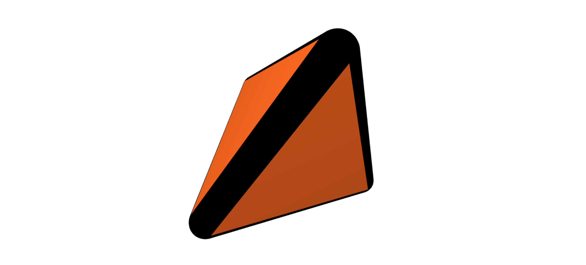
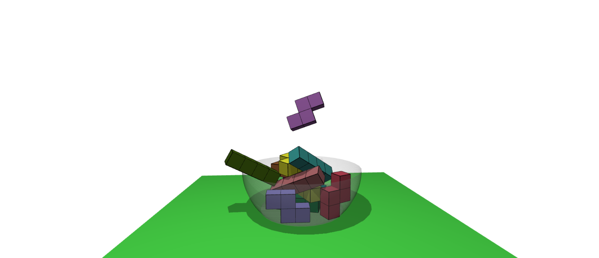
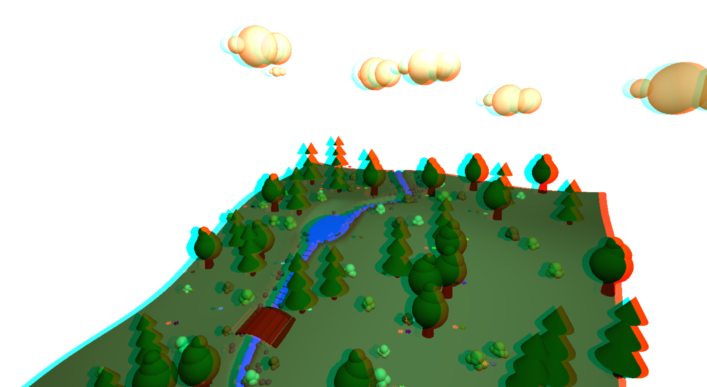
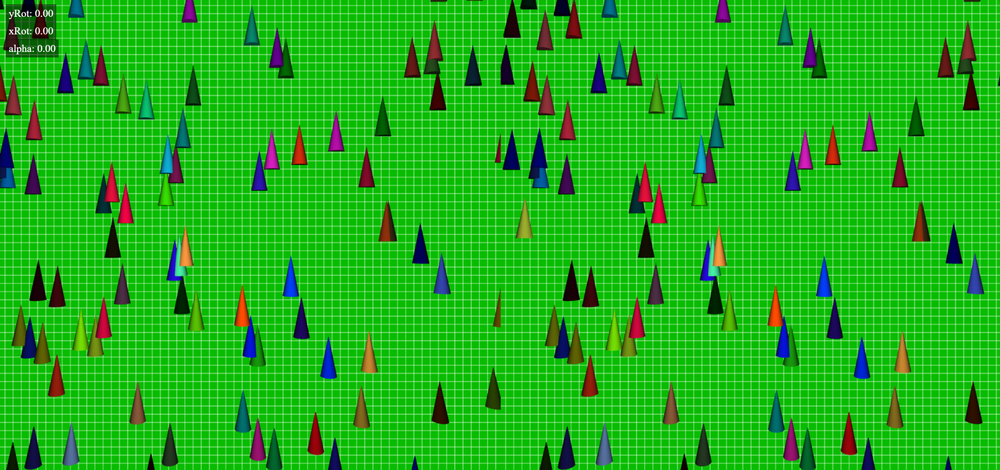
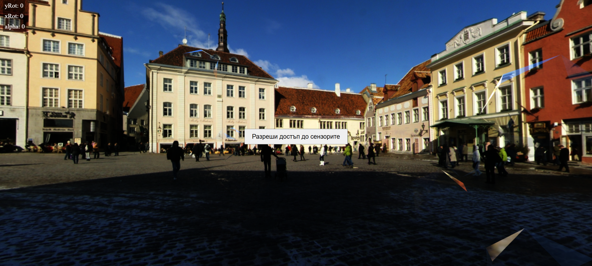

# VAX Three.js Projects  

These are 3D web projects created using **Three.js** for the course **VAX** at FMI under **Pavel Boychev**.

## 🐊 Crocodile  
A simplified cubic crocodile with mathematical animations, standing on an island, simulating waves using two trig functions.  
  

---

## ⚫ Vantablack Edges  
A parametric pyramid with bright orange walls and adjustable vantablack edges.  
  

---

## 🏆 Bowl with PhysiJS  
A transparent cup that fills with Tetris blocks until one block falls out.  
  

---

## 🌲 Forest Park Diorama  
A 3D model of a forest park with a running river, terrain slopes, and a curved water path. Designed for **anaglyph glasses**.  
  

---

## 📱 Phone Operated Cube with Pyramids  
A 3D simulation of pyramids pointing to the center of a cube. Designed for **stereo glasses & phone sensors**.  
  

---

## 🔷 3D Scene with Rotating Icosahedrons  
A **smoothly rotating** scene featuring mirroring **icosahedrons** floating in **Tallinn**, using phone sensors.  
  
